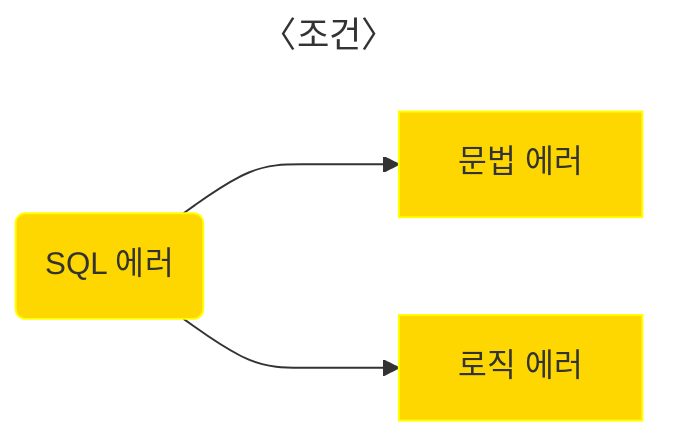

 

# 1. SQL injection 데이터 추출(3)

  ※ 주의 사항 :   

1. 교육 목적으로만 이용 해주세요. 
2. 무단 침입, 데이터 유출, 개인 정보 침해 등 불법적인 활동은 심각한 법적 결과를 초래할 수 있습니다. 
3.  개인적인 테스트 환경을 구축해서 실습하시길 바랍니다. 

 

## 1.1 개요 

 

저번 SQL injection 데이터 추출(2) 포스팅에서 DB데이터가 화면에 출력 될 때 SQL Injection을 해보았습니다.  
사실 데이터 추출 방식에는 3 가지 방식이 있습니다.

 

1. SQL 질의 문 결과가 화면에 출력 되는 경우(데이터추출(2)) => UNION SQL (로그인 or 게시판 등)

2. 에러 메세지가 화면에 출력 되는 경우 => Error Based SQLi (에러 메세지 확인 가능 한 곳)

3. 참과 거짓으로 출력 되는 경우 => Blind SQL Injection (로그인 or 아이디 중복 체크 등)

   와 같은 방식으로 해결할 수 있습니다. 

    

   이번 포스팅에서는 2, 3 번을 배워보도록 합시다.

 

## 1.2  Error Based SQL Injection(에러 메세지를 출력하여 화면에서 볼 수 있을때)

 

### 1.2.1 필요한 개념

***

Error Based SQl Injection은 무엇일까요?  
에러 메세지를 활용해서 데이터를 출력하는 방식입니다.

활용하기 위해서는 조건이 필요합니다.

먼저 SQL에러가 무엇일까요?  
SQL에러는 SQL쿼리에서 발생하는 에러를 뜻합니다.

그렇다면 문법 에러와 로직 에러가 어떤 점이 다른 지 살펴보겠습니다.

<문법에러>

